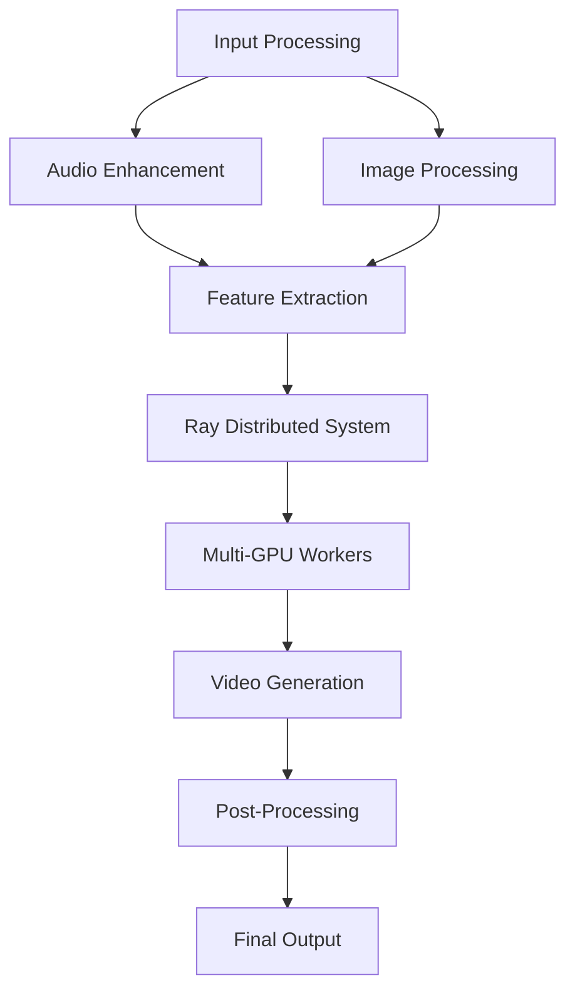

# Multi-GPU Speech-to-Video Generation System Documentation

## Complete System Documentation for Production-Ready S2V Implementation

---

## 📖 Table of Contents

1. [System Overview](#system-overview)
2. [Architecture Details](#architecture-details)
3. [Installation Guide](#installation-guide)
4. [Configuration](#configuration)
5. [Usage Examples](#usage-examples)
6. [Performance Tuning](#performance-tuning)
7. [Monitoring & Debugging](#monitoring--debugging)
8. [API Reference](#api-reference)
9. [Troubleshooting](#troubleshooting)
10. [Contributing](#contributing)

---

## 📊 System Overview

### What is the Multi-GPU S2V System?

This is a production-ready speech-to-video generation system that leverages the Wan2.2 framework with distributed processing capabilities. It converts audio speech and reference images into synchronized video content using multiple GPUs for optimal performance.

### Key Components



### Performance Metrics

| Configuration | GPUs | Resolution | Quality | Speed | Memory |
|--------------|------|------------|---------|-------|--------|
| Basic        | 1    | 640x480   | Medium  | ~2fps | 8GB    |
| Standard     | 2    | 640x480   | High    | ~4fps | 12GB   |
| Professional | 4    | 1280x720  | High    | ~8fps | 16GB   |
| Enterprise   | 8    | 1280x720  | Ultra   | ~15fps| 24GB   |

---

## 🏗️ Architecture Details

### System Architecture

The system follows a distributed microservices architecture:

#### Core Components

1. **Main Controller** (`main_s2v_system.py`)
   - Orchestrates the entire generation pipeline
   - Manages system resources and worker coordination
   - Handles error recovery and logging

2. **Audio Processor** (`enhanced_audio_processor.py`)
   - Advanced audio feature extraction
   - Phoneme analysis and timing alignment
   - Noise reduction and quality enhancement

3. **Distributed Manager** (`distributed_processing_manager.py`)
   - Ray-based task distribution
   - Load balancing across GPUs
   - Performance monitoring and optimization

4. **Video Handler** (`video_output_handler.py`)
   - Frame compilation and synchronization
   - Quality enhancement and post-processing
   - Output format optimization

5. **Multi-GPU System** (`multi_gpu_s2v_system.py`)
   - GPU resource management
   - Worker node coordination
   - Memory optimization strategies

### Data Flow

```
Input Audio & Image
        ↓
    Preprocessing
        ↓
   Feature Extraction
        ↓
    Task Distribution
        ↓
   ┌─────┬─────┬─────┐
   │GPU 1│GPU 2│GPU N│
   └─────┴─────┴─────┘
        ↓
    Frame Collection
        ↓
   Video Compilation
        ↓
    Post-Processing
        ↓
    Final Output
```

---

## 🛠️ Installation Guide

### System Requirements

#### Minimum Requirements
- **OS**: Ubuntu 18.04+ / CentOS 7+ / Windows 10+
- **Python**: 3.8+
- **CUDA**: 11.7+ with compatible drivers
- **GPU Memory**: 8GB per GPU (minimum)
- **RAM**: 16GB system memory
- **Storage**: 50GB free space

#### Recommended Setup
- **GPU**: NVIDIA RTX 3090/4090 or A100
- **GPU Memory**: 24GB per GPU
- **RAM**: 64GB system memory
- **Storage**: NVMe SSD with 200GB+ space
- **Network**: High-speed connection for model downloads

### Step-by-Step Installation

#### 1. Environment Setup

```bash
# Create project directory
mkdir -p /workspace/wan22-comfy-project
cd /workspace/wan22-comfy-project

# Clone required repositories
git clone https://github.com/Wan-Video/Wan2.2.git

# Run automated setup
chmod +x setup.sh
./setup.sh
```

#### 2. Virtual Environment

```bash
# Activate the environment
source venv/bin/activate

# Verify installation
python test_setup.py
```

#### 3. Model Checkpoints

Download the required checkpoints from the official Wan2.2 repository:

```bash
# Create checkpoints directory
mkdir -p checkpoints

# Download models (replace with actual download commands)
# Follow Wan2.2 documentation for checkpoint acquisition
```

#### 4. Configuration Files

```bash
# Copy and customize configuration
cp s2v_config.py custom_config.py

# Edit settings as needed
nano custom_config.py
```

### Verification

```bash
# Run comprehensive system test
python main_s2v_system.py \
  --image test_image.jpg \
  --audio test_audio.wav \
  --prompt "Test generation" \
  --output test_video \
  --quality low
```

---

## ⚙️ Configuration

### Configuration Files

#### Main Configuration (`s2v_config.py`)

```python
class S2VConfig:
    # Video generation defaults
    DEFAULT_VIDEO_PARAMS = {
        "height": 480,
        "width": 640,
        "fps": 30,
        "quality": "medium",
    }
    
    # GPU configuration
    GPU_CONFIG = {
        "min_memory_gb": 8,
        "recommended_memory_gb": 16,
        "max_batch_size": 4,
    }
    
    # Ray configuration
    RAY_CONFIG = {
        "num_cpus": None,  # Auto-detect
        "num_gpus": None,  # Auto-detect
        "object_store_memory": 2000000000,  # 2GB
    }
```

#### Environment Variables

Create a `.env` file:

```bash
# Model and checkpoint paths
WAN_CHECKPOINT_DIR=./checkpoints
OUTPUT_DIR=./outputs
LOG_DIR=./logs

# GPU settings
CUDA_VISIBLE_DEVICES=0,1,2,3
PYTORCH_CUDA_ALLOC_CONF=max_split_size_mb:512

# Ray dashboard
RAY_DASHBOARD_HOST=0.0.0.0
RAY_DASHBOARD_PORT=8265

# Logging
LOG_LEVEL=INFO
ENABLE_PROFILING=false
```

### Quality Presets

#### Low Quality (Fast)
```python
{
    "guidance_scale": 2.0,
    "num_inference_steps": 8,
    "target_resolution": "320x240",
    "processing_time": "~30s per 3s video"
}
```

#### Medium Quality (Balanced)
```python
{
    "guidance_scale": 3.0,
    "num_inference_steps": 15,
    "target_resolution": "640x480",
    "processing_time": "~60s per 3s video"
}
```

#### High Quality (Slow)
```python
{
    "guidance_scale": 4.0,
    "num_inference_steps": 25,
    "target_resolution": "1280x720",
    "processing_time": "~120s per 3s video"
}
```

---

## 🎯 Usage Examples

### Basic Command Line Usage

#### Simple Generation
```bash
python main_s2v_system.py \
  --image portrait.jpg \
  --audio speech.wav \
  --prompt "A person giving a presentation" \
  --output presentation_video
```

#### High-Quality Generation
```bash
python main_s2v_system.py \
  --image portrait.jpg \
  --audio speech.wav \
  --prompt "Professional speaker at conference" \
  --quality high \
  --width 1280 \
  --height 720 \
  --fps 30 \
  --enhance-quality \
  --optimize-streaming
```

#### Multi-GPU Production Setup
```bash
python main_s2v_system.py \
  --image input.jpg \
  --audio input.wav \
  --prompt "Generated video content" \
  --gpus 4 \
  --quality high \
  --output-dir /production/outputs \
  --log-level INFO \
  --save-stats
```

### Python API Usage

#### Basic API Example
```python
from main_s2v_system import IntegratedS2VSystem

# Initialize system
system = IntegratedS2VSystem(
    num_gpus=2,
    checkpoint_dir="./checkpoints",
    output_dir="./outputs"
)

# Generate video
result = system.generate_video(
    image_path="portrait.jpg",
    audio_path="speech.wav",
    prompt="A professional speaker",
    quality="medium",
    enhance_quality=True
)

print(f"Generated: {result['output_path']}")
print(f"Time: {result['generation_time']:.2f}s")

# Cleanup
system.cleanup()
```

#### Batch Processing Example
```python
import glob
from pathlib import Path

# Initialize system once
system = IntegratedS2VSystem(num_gpus=4)

# Process multiple files
images = glob.glob("inputs/images/*.jpg")
audios = glob.glob("inputs/audio/*.wav")

results = []
for img_path, audio_path in zip(images, audios):
    try:
        result = system.generate_video(
            image_path=img_path,
            audio_path=audio_path,
            prompt=f"Video from {Path(img_path).stem}",
            output_name=Path(img_path).stem + "_video"
        )
        results.append(result)
        print(f"✓ Generated: {result['output_path']}")
    except Exception as e:
        print(f"✗ Failed {img_path}: {e}")

# Cleanup
system.cleanup()
print(f"Processed {len(results)} videos successfully")
```

#### Custom Configuration Example
```python
from s2v_config import S2VConfig

# Customize configuration
custom_config = {
    'model_name': 's2v-14B',
    'custom_quality_preset': {
        'guidance_scale': 3.5,
        'num_inference_steps': 20,
        'enhance_frames': True
    }
}

system = IntegratedS2VSystem(
    config=custom_config,
    num_gpus=4,
    output_dir="./custom_outputs"
)

result = system.generate_video(
    image_path="input.jpg",
    audio_path="input.wav",
    prompt="Custom generation",
    **custom_config['custom_quality_preset']
)
```

---

## 🚀 Performance Tuning

### GPU Optimization

#### Memory Management
```python
# Environment variables for memory optimization
export PYTORCH_CUDA_ALLOC_CONF=max_split_size_mb:256
export CUDA_LAUNCH_BLOCKING=0

# In code optimizations
torch.backends.cudnn.benchmark = True
torch.backends.cuda.matmul.allow_tf32 = True
```

#### Batch Size Tuning
```python
# Configuration based on GPU memory
GPU_MEMORY_GB = 24
optimal_batch_size = min(4, GPU_MEMORY_GB // 6)

S2VConfig.GPU_CONFIG['max_batch_size'] = optimal_batch_size
```

### Ray Cluster Optimization

#### Resource Allocation
```python
ray.init(
    num_cpus=os.cpu_count(),
    num_gpus=torch.cuda.device_count(),
    object_store_memory=4000000000,  # 4GB
    plasma_directory="/tmp/plasma",
    huge_pages=False,
    include_dashboard=True
)
```

#### Load Balancing
```python
# Custom scheduling strategy
from distributed_processing_manager import LoadBalancer

load_balancer = LoadBalancer(monitor)
optimal_chunk_size = load_balancer.suggest_optimal_chunk_size(
    total_frames=150,
    num_workers=4
)
```

### System Monitoring

#### GPU Monitoring Script
```python
#!/usr/bin/env python3
import time
import GPUtil
import psutil

def monitor_system(interval=5):
    while True:
        # GPU stats
        gpus = GPUtil.getGPUs()
        for gpu in gpus:
            print(f"GPU {gpu.id}: {gpu.memoryUtil*100:.1f}% memory, {gpu.load*100:.1f}% util")
        
        # System stats
        cpu_percent = psutil.cpu_percent()
        memory_percent = psutil.virtual_memory().percent
        print(f"CPU: {cpu_percent:.1f}%, RAM: {memory_percent:.1f}%")
        print("-" * 50)
        
        time.sleep(interval)

if __name__ == "__main__":
    monitor_system()
```

---

## 📊 Monitoring & Debugging

### Real-Time Monitoring

#### Ray Dashboard
Access at `http://localhost:8265`:
- Task execution timeline
- Resource utilization graphs
- Worker status and logs
- Error tracking and debugging

#### System Statistics
```python
# Get comprehensive system status
status = system.get_system_status()
print(json.dumps(status, indent=2))
```

### Logging Configuration

#### Advanced Logging Setup
```python
import logging
from logging.handlers import RotatingFileHandler

# Configure rotating log files
handler = RotatingFileHandler(
    's2v_system.log',
    maxBytes=100*1024*1024,  # 100MB
    backupCount=5
)

logging.basicConfig(
    level=logging.INFO,
    format='%(asctime)s - %(name)s - %(levelname)s - %(message)s',
    handlers=[handler, logging.StreamHandler()]
)
```

### Performance Profiling

#### Enable Profiling
```bash
# Run with profiling enabled
python main_s2v_system.py \
  --image input.jpg \
  --audio input.wav \
  --prompt "Profile test" \
  --log-level DEBUG \
  --save-stats
```

#### Analyze Results
```python
import json

# Load saved statistics
with open('outputs/detailed_stats_abc123.json', 'r') as f:
    stats = json.load(f)

# Analyze performance
processing_times = [worker['average_processing_time'] 
                   for worker in stats['system_stats']['worker_stats'].values()]
print(f"Average processing time: {sum(processing_times)/len(processing_times):.2f}s")
```

---

## 🔧 API Reference

### Main Classes

#### IntegratedS2VSystem
```python
class IntegratedS2VSystem:
    def __init__(self, config=None, num_gpus=None, checkpoint_dir=None, output_dir=None):
        """Initialize the integrated S2V system"""
        
    def generate_video(self, image_path, audio_path, prompt, output_name=None, **params):
        """Generate video from inputs"""
        
    def get_system_status(self):
        """Get comprehensive system status"""
        
    def cleanup(self):
        """Clean up system resources"""
```

#### EnhancedAudioProcessor
```python
class EnhancedAudioProcessor:
    def extract_features(self, audio_path, return_phonemes=True, return_timing=True):
        """Extract comprehensive audio features"""
        
    def align_audio_to_video(self, audio_features, video_fps, target_frames):
        """Align audio features to video frames"""
        
    def enhance_audio_quality(self, audio_path, output_path=None):
        """Enhance audio quality before processing"""
```

#### VideoCompiler
```python
class VideoCompiler:
    def compile_chunks(self, chunk_results, output_path, fps=30, enhance_quality=True):
        """Compile video chunks into final video"""
        
    def add_audio(self, video_path, audio_path, output_path=None):
        """Add audio to compiled video"""
        
    def optimize_for_streaming(self, video_path, output_path=None, bitrate='2M'):
        """Optimize video for streaming"""
```

### Configuration Classes

#### S2VConfig
```python
class S2VConfig:
    DEFAULT_VIDEO_PARAMS = {...}
    QUALITY_PRESETS = {...}
    GPU_CONFIG = {...}
    RAY_CONFIG = {...}
    
    @classmethod
    def validate_environment(cls):
        """Validate the environment setup"""
        
    @classmethod
    def get_optimal_gpu_config(cls, available_gpus, memory_per_gpu):
        """Get optimal GPU configuration"""
```

---

## 🐛 Troubleshooting

### Common Issues and Solutions

#### Out of Memory Errors

**Problem**: CUDA out of memory during generation
```
RuntimeError: CUDA out of memory. Tried to allocate X MB (GPU 0)
```

**Solutions**:
```bash
# 1. Reduce quality settings
python main_s2v_system.py --quality low --gpus 1

# 2. Set memory fraction
export PYTORCH_CUDA_ALLOC_CONF=max_split_size_mb:256

# 3. Clear GPU cache
python -c "import torch; torch.cuda.empty_cache()"
```

#### Ray Initialization Failures

**Problem**: Ray fails to start or connect
```
RuntimeError: Failed to start Ray
```

**Solutions**:
```bash
# 1. Stop existing Ray processes
ray stop --force

# 2. Clear temporary files
rm -rf /tmp/ray

# 3. Set custom temp directory
export RAY_TMPDIR="/path/to/large/disk"
```

#### Model Loading Issues

**Problem**: Cannot load model checkpoints
```
FileNotFoundError: Model checkpoint not found
```

**Solutions**:
```bash
# 1. Verify checkpoint directory
ls -la ./checkpoints/

# 2. Check configuration
python -c "from wan.configs import WAN_CONFIGS; print(WAN_CONFIGS['s2v-14B'])"

# 3. Re-download checkpoints
# Follow Wan2.2 documentation
```

#### Performance Issues

**Problem**: Slow generation speed

**Diagnosis**:
```bash
# Monitor GPU utilization
nvidia-smi -l 1

# Check system resources
htop

# Ray dashboard
open http://localhost:8265
```

**Solutions**:
```bash
# 1. Increase worker count
python main_s2v_system.py --gpus 4

# 2. Optimize chunk size
# System automatically determines optimal size

# 3. Use faster storage
# Move checkpoints to SSD

# 4. Enable mixed precision
export TORCH_AUTOCAST_ENABLED=1
```

### Debug Mode

#### Enable Comprehensive Debugging
```bash
python main_s2v_system.py \
  --log-level DEBUG \
  --save-stats \
  --image input.jpg \
  --audio input.wav \
  --prompt "Debug test"
```

#### Log Analysis
```bash
# Real-time log monitoring
tail -f s2v_generation_*.log

# Error pattern analysis
grep -i "error\|exception\|failed" s2v_generation_*.log

# Performance analysis
grep -i "processing time\|memory\|gpu" s2v_generation_*.log
```

---

## 🤝 Contributing

### Development Guidelines

#### Code Standards
- Follow PEP 8 style guidelines
- Use type hints for function parameters and returns
- Include comprehensive docstrings
- Write unit tests for new features
- Maintain backward compatibility

#### Testing
```bash
# Run unit tests
python -m pytest tests/

# Run integration tests
python test_setup.py

# Run performance benchmarks
python benchmark_system.py
```

#### Submission Process
1. Fork the repository
2. Create a feature branch
3. Implement changes with tests
4. Update documentation
5. Submit a pull request

### Feature Requests

When submitting feature requests, include:
- Clear description of the proposed feature
- Use cases and benefits
- Implementation approach (if known)
- Potential impact on performance

### Bug Reports

Include the following in bug reports:
- System specifications (GPU, memory, OS)
- Exact command used
- Complete error message and traceback
- Log files (if available)
- Steps to reproduce the issue

---

## 📄 License and Credits

### License
This project builds upon the Wan2.2 framework and follows its licensing terms. See `LICENSE.txt` in the Wan2.2 directory for details.

### Acknowledgments
- **Wan2.2 Team**: For the foundational speech-to-video framework
- **Ray Project**: For distributed computing capabilities  
- **PyTorch Community**: For deep learning infrastructure
- **Open Source Contributors**: For various supporting libraries

### Citations
If you use this system in your research, please cite:
```bibtex
@software{multi_gpu_s2v_system,
  title={Multi-GPU Speech-to-Video Generation System},
  author={GitHub Copilot},
  year={2025},
  url={https://github.com/your-repo/multi-gpu-s2v-system}
}
```

---

**© 2025 Multi-GPU S2V System - Production-Ready Speech-to-Video Generation**